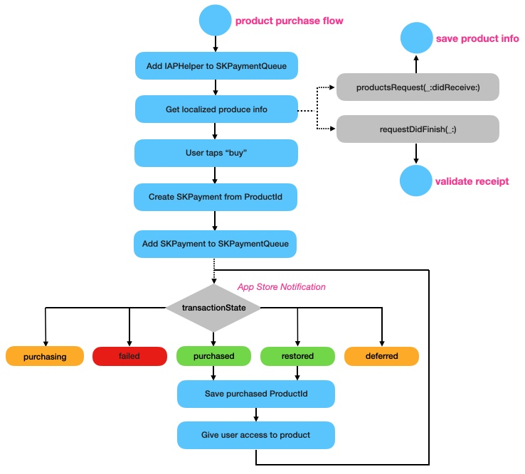

#  IAPHelper

How to implement and test In-App Purchase code in Xcode 12 and iOS 14

## Overview
The code we write to manage in-app purchases is critically important to the success of our apps.
However, anybody who's had to tackle this non-trivial task faces a similar set of challenges:

* How to define a set of products your app supports?
* Working with StoreKit to request localized product data and initiate purchases (and restoring purchases) 
* Implementing StoreKit delegate methods to process async notifications of purchase success, failure, etc.
* Should you handle App Store receipt validation on-device or server-side?
* Should you write your own receipt validation code or use a service like RevenueCat?
* Working with OpenSSL and the arcane ASN.1 data structures found in receipts
* Writing code to validate the receipt and read in-app purchase data
* Defining in-app purchases in App Store Connect
* Creating and managing sandbox account used for testing

Most developers taking on this set of tasks for the first time are struck by how daunting it all is. 

When I first implemented in-app purchases in 2016 the two main pain-points for me were:

* Receipt validation
    * The App Store issues an encrypted receipt when in-app purchases are made
    * The receipt contains a complete list of all in-app purchases made in the app
    * Reading and validating the contents of the receipt can be done completely on-device or server-side
    * Server-side validation is easier, but means you need an app server to send requests to the App Store server
    * Note that Apple specifically says **not** to create a direct connection to the App Store server from your app for reasons of security
    * Validation on-device is tricky and requires use the OpenSSL library to decrypt and read the data
    
* Working with sandbox accounts to test in-app purchases
    * You need to create multiple sandbox test accounts in App Store Connect (or iTunes Connect as it then was)
    * Each sandbox account has to have a unique email address and be validated as an AppleID
    * Tests must be on a real device, not the simulator
    * You need to sign out of your normal AppleID and sign-in using the sandbox account - this really means you need a spare device to do testing on
    * Each time you make a purchase using a sandbox account that acount becomes "used up" - it can't be used to re-purchase the same product 
    * There's no way to clear purchases, so you need to use a fresh sandbox account for each set of product purchases
