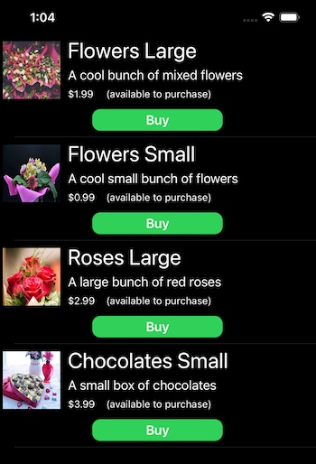

#  IAPTestingDemo

Implementing and testing In-App Purchases in Xcode 12 and iOS 14

# Contents

{{TOC}}

# Overview
The code we write to manage in-app purchases is critically important to the success of our apps. However, if you've not tackled it
before, implementing and testing in-app purchases is daunting, complex and seems *way* more involved than you'd expect!   

Anybody wanting to support in-app purchases faces a similar set of challenges:

* How do you define the set of products that can be purchased in your app?
* Defining your in-app purchases in App Store Connect
* Working with StoreKit to request *localized* product data from the App Store and initiate purchases
* Implementing StoreKit delegate methods to process async notifications for purchase success, failure, restoring purchases, etc.
* Handling edge-cases, like when a purchase is deferred because it requires parental permissions, or when entitlements for a user have changed and access to the specified IAPs has been revoked
* Should you handle App Store receipt validation on-device or server-side?
* Should you write your own receipt validation code or use a service like [RevenueCat](https://www.revenuecat.com)?
* Working with OpenSSL and the arcane ASN.1 data structures found in receipts
* Writing code to validate the receipt and read in-app purchase data
* Creating and managing sandbox accounts used for testing

When I first implemented in-app purchases in one of my apps in 2016 the two main pain-points were:

* [Receipt validation](#Receipt-validation)
* [Sandbox accounts](#Sandbox-accounts)

## Receipt validation options
The App Store issues an encrypted receipt when in-app purchases are made or restored (when an app's first installed, no receipt is present).
This receipt contains a complete list of all in-app purchases made in the app. There are three approaches available to validating the receipt:

* Server-side receipt validation
* On-device receipt validation
* No receipt validation

**Server-side validation**<br/>
This is easier, *but* you need an app server to send requests to the App Store server. Apple specifically says
you **should not** create direct connections to the App Store server from your app because you can't guard against
man-in-the-middle attacks. Despite this clear warning, the web has many examples (including commercial offerings) of using
direct app-to-App Store connections. The advantage of using server-side validation is that you can retrieve easily decoded
JSON payloads that include all the in-app purchase data you need. We don't cover server-side validation in this example.

**On-device validation**<br/>
Local on-device validation is tricky and requires use of the C-based [OpenSSL](https://www.openssl.org) library
to decrypt and read the data. Note that including the required two OpenSSL libraries adds nearly 50MB to your app.

Back in 2016 I fully expected StoreKit or some other Apple framework to provide ready-to-use abstractions allowing for easy access
to the low-level cryptographic data structures in the receipt. However, as I looked deeper into the "where's the receipt processing framework?"
conundrum the more the answer became clear: having a ready-to-use framework creates a security risk because "hackers" wishing to access your
in-app purchases for-free know in advance where and how to concentrate their attacks. Apple's answer was (*and still is*): create your own custom
receipt validation solution because a unique solution will be harder to hack.

Clearly a custom solution (if done correctly) will be more secure. But, as all developers know that have attempted it, writing security-critical
cryptographic-related code is **hard** and if you get it wrong disasters will happen! In my opinion, surely it would be better for Apple to
provide something that enables correct and *reasonably secure* receipt validation for the general app developer?

However, at present (August 2020) you have no choice if you want to validate and read receipt data on-device: you must develop your
own OpenSSL-based solution. If you don't feel confident doing this feel free to adapt (or use as-is) the code presented in the
[IAPHelper Framework](#IAPHelper-Framework).

**No receipt validation**<br/>
It's perfectly possible to do no receipt validation at all, if you think that's appropriate for your app's business model. All you need to do is handle
transactions from the App Store using the following method:

``` swift
paymentQueue(_:updatedTransactions:)
```

When you get a *.purchased* or *.restored* transaction simply add the product identifier for the product to a list
of purchased products that your app maintains. The list should be persisted in a database, or even UserDefaults. Clearly, this is
a far less secure approach than doing receipt validation. However, you may decide that a particular app doesn't warrant the greater
protection and associated complexity provided by receipt validation. See [Basic Example](#Basic-Example) below for an example of this approach.

## Sandbox accounts
Prior to Xcode 12, in order to test in-app purchases you needed to create multiple sandbox test accounts in App Store Connect.
Each sandbox account has to have a unique email address and be validated as an AppleID. In addition, tests must be on a real device,
not the simulator.

On the test device you need to sign out of your normal AppleID and sign-in using the sandbox account. This really means you need a
spare device to do testing on. To make things more painful, each time you make a purchase using a sandbox account that account
becomes "used up" and can't be used to re-purchase the same product. There's no way to clear purchases, so you need to use a fresh
sandbox account for each set of product purchases.

# Basic Steps
The basic steps you need to take to support in-app purchases (IAP hereafter) in your app are as follows:


* **Create an IAP helper class**\
Create a class or struct that will contain all your IAP-related code. For the sake of example we'll refer to this as the **IAPHelper** code

* **Define your ProductIds**\
Define a set of Strings that hold *ProductIds* for the products you want to sell. ProductIds are generally in reverse domain form ("com.your-company.your-product"). For example, "com.rarcher.flowers-large". These ids will match the product ids you define in App Store Connect

* **Add your IAPHelper to the Payment Queue**\
To receive notifications from the App Store (when payments are successful, fail, are restored, etc.) add your IAPHelper to the StoreKit payment queue.
This should be done as soon as possible in the app's lifecycle. For example in *application(_:didFinishLaunchingWithOptions:)*, so that notifications
from the App Store are not missed:

``` swift
SKPaymentQueue.default().add(iapHelper)
```

* **Request localized product information from the App Store**\
The *SKProductsRequestDelegate* method **productsRequest(_:didReceive:)** will be called asynchronously with a list of *SKProduct* objects.
Note that you can't simply use predefined product data because you need to display prices, etc. that are *localized* for each user

* **Process the App Store Receipt**\
The App Store will asynchronously send a *receipt* that can be received on the *SKRequestDelegate* method **requestDidFinish(_:)**.
This receipt, which is cryptographically signed and encrypted, contains a complete record of all the IAPs made by the user of your app

* **Present the localized product list to the user and handle purchases**\
When the user taps on "buy product" you should wrap the selected *SKProduct* in an *SKPayment* object, then add it to the **SKPaymentQueue**.
The App Store will then send notifications to the *SKPaymentTransactionObserver* method **paymentQueue(_:updatedTransactions)** as
the purchase progresses. Note that the App Store presents the user with all the required purchase prompts and confirmations

The code discussed in [Basic Example](#Basic-Example) below provides a practical example of the above points (receipt validation is covered later).

# Xcode 12 Improvements
Immediately before Apple's WWDC 2020 keynote event I tweeted that I was hoping for something "magical and unexpected". I followed this up with
"How about an update to StoreKit that makes it really easy to do on-device validation of App Store receipts". Well, I didn't get my wish with regard to
receipt validation, but I certainly got something magical and unexpected related to StoreKit and in-app purchases!

Starting with Xcode 12, there's a new local StoreKit test environment that allows you to do early testing of IAPs in the simulator and without having to set anything up in App Store Connect. You can define your products locally in a **StoreKit Configuration file**. Furthermore, you can view and delete
transactions, issue refunds, and a whole lot more. There's also a new **StoreKitTest** framework that enables you to do automated testing of IAPs.
The [Basic Example](#Basic-Example) project below includes details on how to create and use a StoreKit configuration file.

<br/>

These new features are a huge leap forward in terms of making testing substantially easier, quicker to setup, more flexible and less frustrating!

# Basic Example
The following example shows how to create a **very minimal IAP example** (the IAP equivalent of "Hello World") that makes use of the new StoreKit 
testing features in Xcode 12. 

***Note that StoreKit testing requires Xcode 12 and iOS 14.***

Although this is a bare-bones example, the project does demonstrate most of the essential requirements for handling in-app 
purchases in an iOS app.

You can find the code for **IAPTestingMinimal** [on GitHub](https://github.com/russell-archer/IAPTestingMinimal).

<br/>

Note that this example project is missing some features a real-world app would be expected to support:

* The App Store receipt is not validated, nor is IAP data read from the receipt
* Purchases are not persisted. So, if the app's closed and restarted no purchases are remembered
* There's no way to restore previous purchases
* Deferred purchases aren't supported
* Edge cases are not supported (refunds, entitlements being revoked, store front changes, purchasing IAPs directly from the app store, etc.)  

For this example we'll assume you're going to create a demo app from scratch using iOS 14 and Xcode 12:

* [Add the StoreKit Framework](#Add-the-StoreKit-Framework)
* [Create the StoreKit configuration file](#Create-the-StoreKit-configuration-file)
* [Add the in-app purchase capability](#Add-the-in-app-purchase-capability)
* [Enable StoreKit Testing via the Project Scheme](#Enable-StoreKit-Testing-via-the-Project-Scheme)
* [Add the StoreKit public certificate](#Add-the-StoreKit-public-certificate)
* [IAPHelper Code](#IAPHelper-Code)

## Add the StoreKit Framework
The first thing you need to do after creating your new app is to add the StoreKit framework. 
Select your app Target and the **General** tab, then add the StoreKit framework:


## Create the StoreKit configuration file
Now create a StoreKit configuration file. Select **File > New > File** and choose the *StoreKit Configuration File* template:

<br/>

Choose a location in your project to save the file.

Open the StoreKit configuration file and click **+** to add an in-app purchase. For this example select the non-consumable option:

<br/>

You can now define your products in the StoreKit configuration file:

<br/>

In this example I set the following fields:

* **Reference Name**<br/>
A descriptive name for the product

* **Product ID**<br/>
This the unique code used to identify an IAP product. This same ID will be used in App Store Connect when setting up in-app purchases for production.
Note that Product ID is a string that, by convention, uses the format "*com.developer.product*", although it can be anything you like

* **Price**<br/>
A hard-coded price for the product. In production your app will request localized price (and other) information from the App Store

By default, the first localization is for the US store. However, you can add as many localizations as required:

<br/>

Note that **none of the data defined in the .storekit file is ever uploaded to App Store Connect**. It's only used when testing in-app purchases locally in Xcode.

## Add the in-app purchase capability
It's easy to forget to do this! And you can successfully test in-app purchases *without* adding the IAP capability. However, you will receive the following error 
when attempting to archive a project in preparation for uploading it to the App Store:

<br/>

Add the in-app purchase capability by selecting the app target and **Signing & Capabilities**, then click **+** **Capability** to add a capability:

<br/>

<br/>

## Enable StoreKit Testing via the Project Scheme
You now need to enable StoreKit testing in Xcode (it's disabled by default).<br/>

Select **Product > Scheme > Edit Scheme**.
Now select **Run** and the **Options** tab. You can now select your configuration file from the *StoreKit Configuration* list:

<br/>

Should you wish to disable StoreKit testing then repeat the above steps and remove the StoreKit configuration file from the *StoreKit Configuration* list.

## Add the StoreKit public certificate
You need to add the StoreKit public test certificate to your project. This isn't strictly necessary if you're not going to be doing any receipt validation. 
However, we'll include the details here for completeness. 

StoreKit testing in Xcode generates *locally signed* receipts that your app must validate locally against the StoreKit test certificate. In production your 
app will include the Apple Root Certificate and use that when validating the App Store receipt. 

In Xcode project navigator, select the StoreKit configuration file. Now select **Editor > Save Public Certificate**.

Choose a location in your project to save the file.

You now need to ensure your app uses the correct certificate in all environments. The easiest way to do this is to create a simple helper which returns the correct certificate name for the runtime environment:

``` swift
/// Constants used in support of IAP operations.
public struct IAPConstants {

    /// The appropriate certificate to use for DEBUG and RELEASE builds.
    /// - Returns: Returns the appropriate certificate to use for DEBUG and RELEASE builds.
    public static func Certificate() -> String {
        #if DEBUG
        return "StoreKitTestCertificate"  // This is issued by StoreKit for local testing
        #else
        return "AppleIncRootCertificate"  // Used in release with the real App Store
        #endif
    }
}

```

## Minimal IAPHelper Code
In this example we'll put all IAP related code into a single **IAPHelper** class. We set this up as a singleton, ensuring there's only ever a single instance of the class:

``` swift
public class IAPHelper: NSObject  {
    
    /// Singleton access. Use IAPHelper.shared to access all IAPHelper properties and methods.
    public static let shared: IAPHelper = IAPHelper()
   
    /// Private initializer prevents more than a single instance of this class being created. 
    /// See the public static 'shared' property. This helper must be initialized as soon as 
    /// possible in the app's lifecycle. See application(_:didFinishLaunchingWithOptions:).
    private override init() {
        super.init()
        
        // Add ourselves to the payment queue so we get App Store notifications        
        SKPaymentQueue.default().add(self)  
    }
    :
    :
}
```

In AppDelegate we initialise IAP Helper:

``` swift
class AppDelegate: UIResponder, UIApplicationDelegate {

    public var iapHelper: IAPHelper?
    
    func application(_ application: UIApplication, didFinishLaunchingWithOptions launchOptions: [UIApplication.LaunchOptionsKey: Any]?) -> Bool {
        // Make sure the IAPHelper is initialized early in the app's lifecycle 
        // to ensure we don't miss any App Store notifications
        iapHelper = IAPHelper.shared
        return true
    }
```

Then in the initial ViewController we request a list of localized product information:

``` swift
class ViewController: UIViewController {

    private let iap = IAPHelper.shared
    
    override func viewDidLoad() {
        :
        configureProducts()
    }
    
    private func configureProducts() {
        // Ask the App Store for a list of localized products
        iap.requestProductsFromAppStore { _ in
            self.tableView.reloadData()
        }
    }
}
```

When the user wants to purchase a product we call **IAPHelper.buyProduct(_:completion:)** and handle the result in a closure:

``` swift
extension ViewController: ProductCellDelegate {
    
    internal func requestBuyProduct(productId: ProductId) {
        guard let product = iap.getStoreProductFrom(id: productId) else { return }
        
        // Start the process to purchase the product
        iap.buyProduct(product) { notification in
            switch notification {
            case .purchaseAbortPurchaseInProgress: print("Purchase aborted because another purchase is being processed")
            case .purchaseCompleted(productId: let pid): print("Purchase completed for product \(pid)")
            case .purchaseCancelled(productId: let pid): print("Purchase cancelled for product \(pid)")
            case .purchaseFailed(productId: let pid): print("Purchase failed for product \(pid)")
            default: break
            }
            
            self.tableView.reloadData()  // Reload data for a success, cancel or failure
        }
    }
}
```

# IAPHelper

# How to Validate Receipts

# IAPTestingDemo Example

